# 🛍️ UniShop - E-commerce App

Aplicativo de e-commerce moderno desenvolvido com **React Native (Expo)**, focado em responsividade (Mobile & Web) e experiência do usuário.

## 📱 Funcionalidades
- **Multi-Plataforma:** Layout adaptativo para Celular (Lista) e PC (Grade e Detalhes lado a lado).
- **Temas:** Suporte completo a Modo Claro e Modo Escuro.
- **Carrinho Inteligente:** Adição, remoção, controle de quantidade e persistência de estado.
- **Internacionalização:** Tradução dinâmica de produtos da API (Inglês -> Português).
- **API Integration:** Consumo da DummyJSON API.

## 🛠️ Tecnologias
- React Native / Expo
- Context API (Gerenciamento de Estado Global)
- React Navigation (Stack & Bottom Tabs)
- Axios (Requisições HTTP)

## 📸 Screenshots

### 📱 Mobile (Android/iOS)

**Navegação e Categorias**
| Login | Perfil | Home (Masculino) | Home (Feminino) |
|:---:|:---:|:---:|:---:|
| 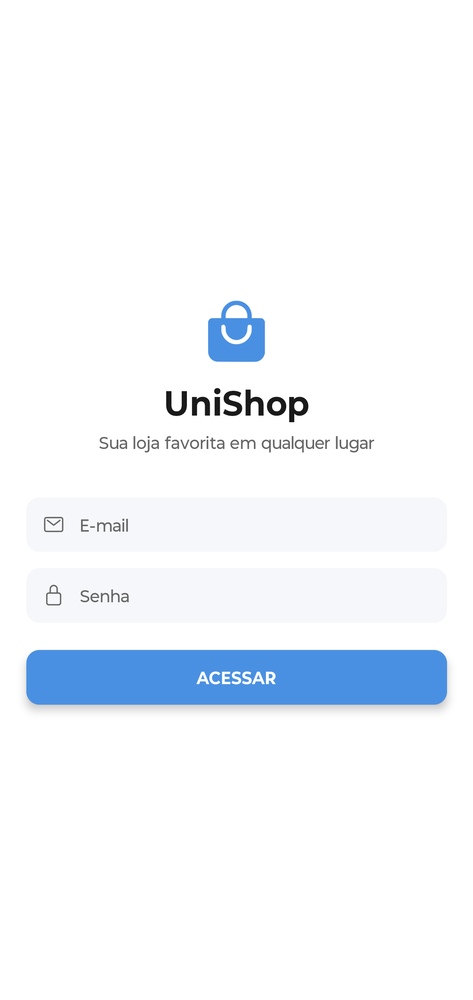 | 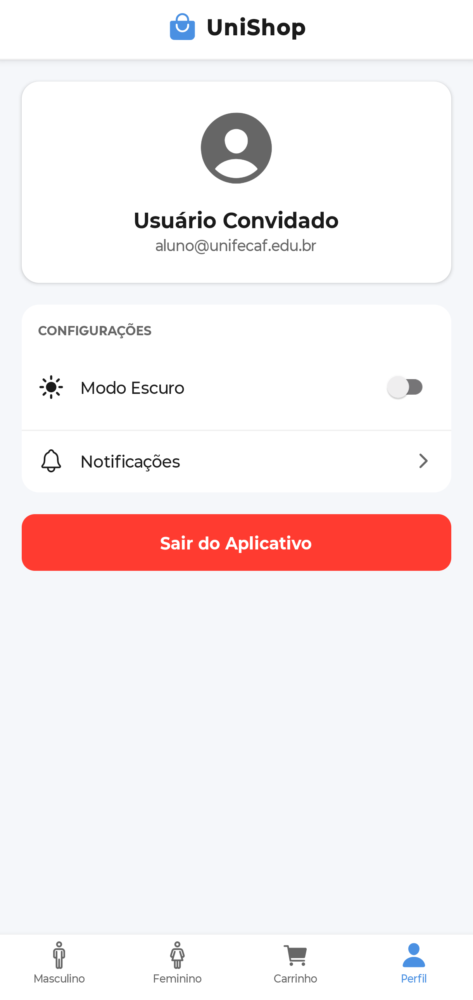 |  | 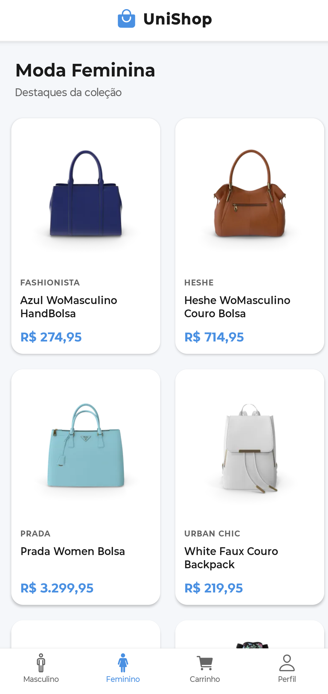 |

**Fluxo de Compra**
| Ver Produto | Add ao Carrinho | Ver Carrinho | Pedido Finalizado |
|:---:|:---:|:---:|:---:|
| 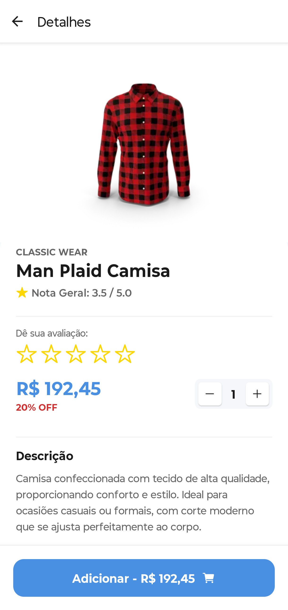 | 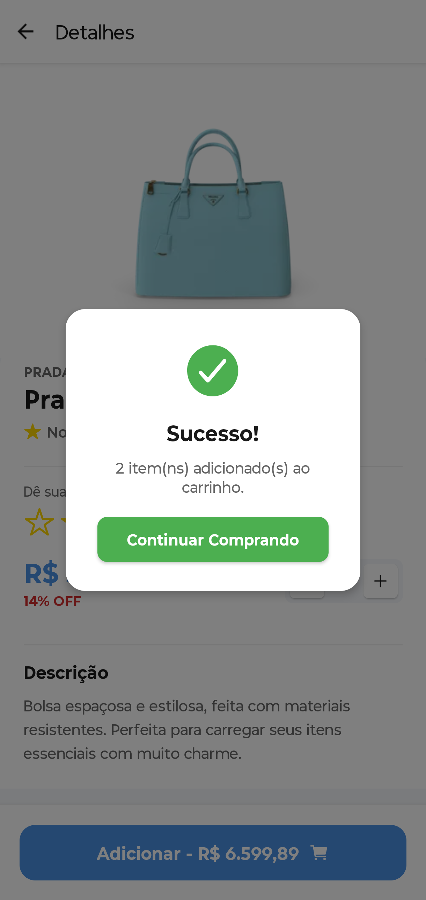 | 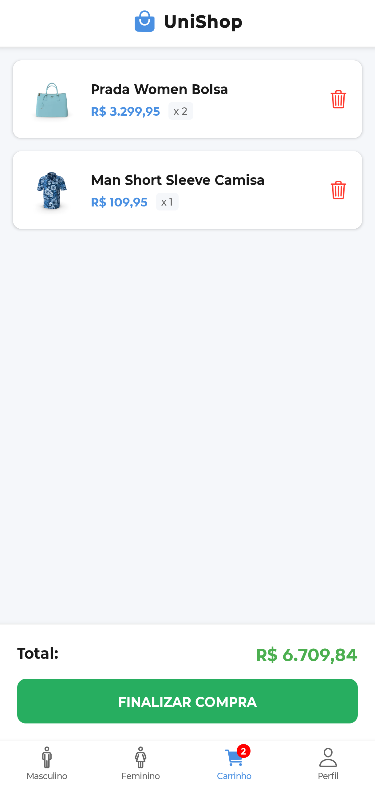 | 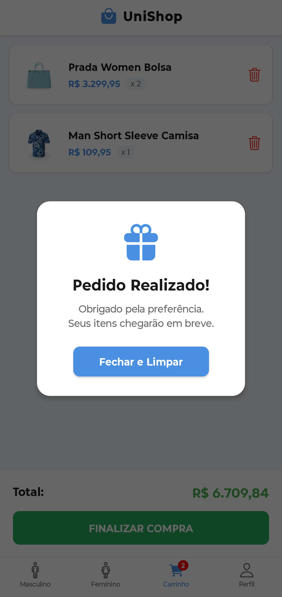 |

---

### 💻 Desktop (Web)

**Categorias (Grade)**
| Moda Masculina | Moda Feminina |
|:---:|:---:|
| 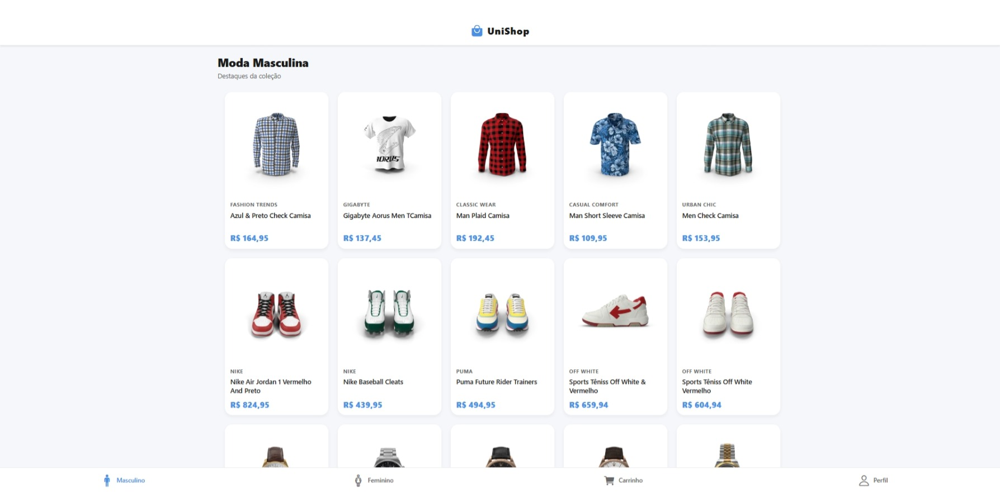 | 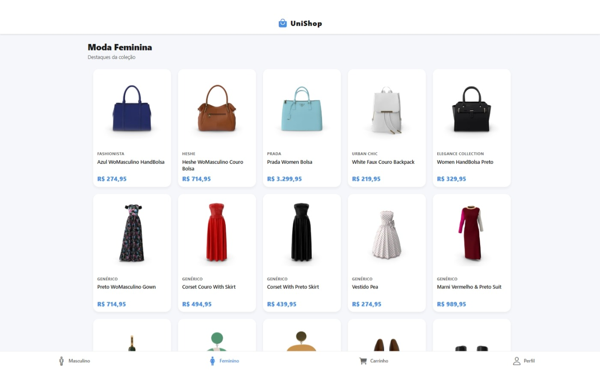 |

**Detalhes do Produto**
| Visualização (Lado a Lado) | Item Adicionado (Modal) |
|:---:|:---:|
| 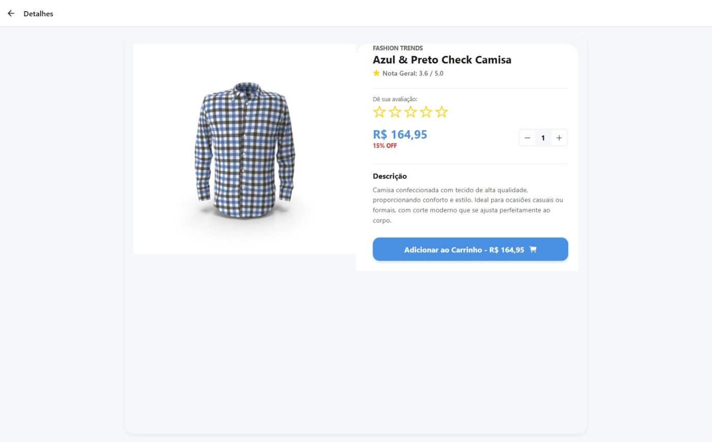 | 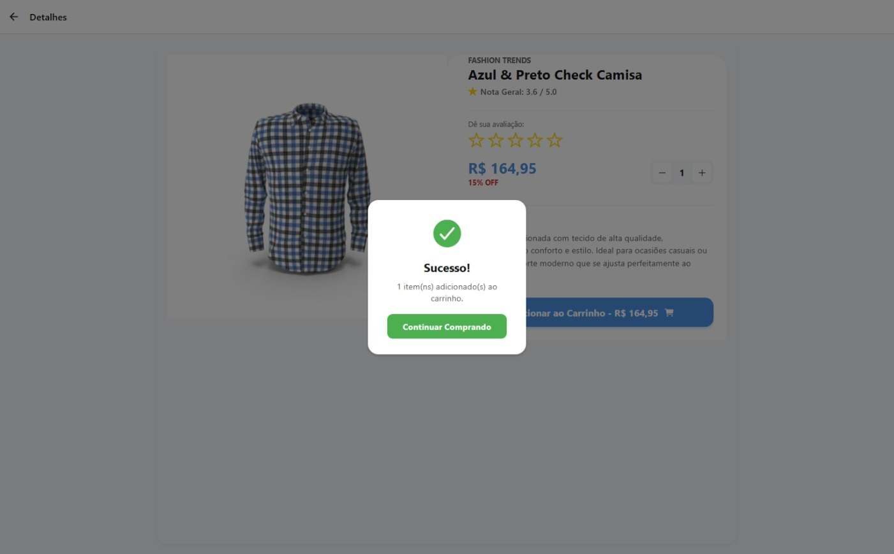 |

**Carrinho de Compras**
| Lista de Itens | Confirmação de Pedido |
|:---:|:---:|
| 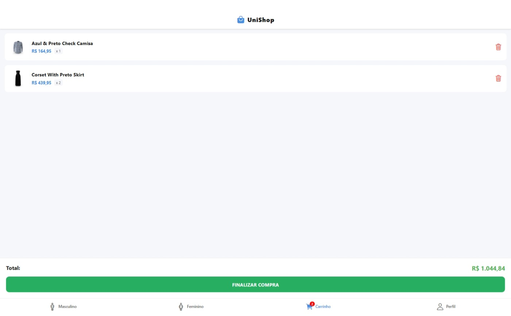 | 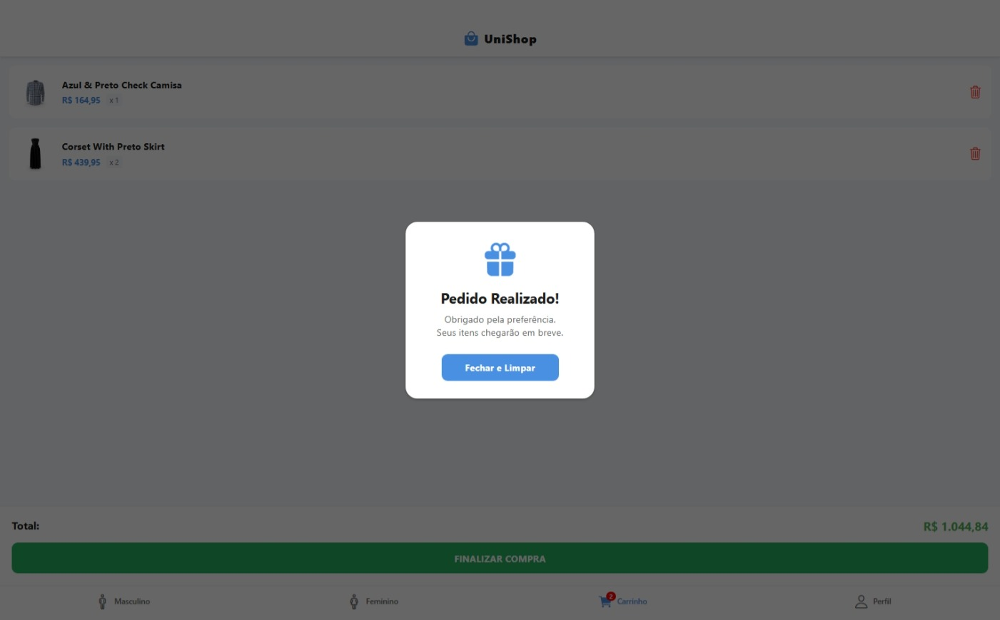 |

---

## 🚀 Como rodar
1. Clone o repositório.
2. `npm install`
3. `npx expo start`
4. Pressione `w` para Web ou leia o QR Code com o app Expo Go.